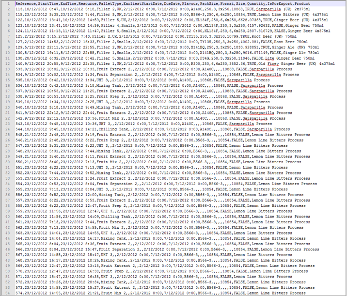
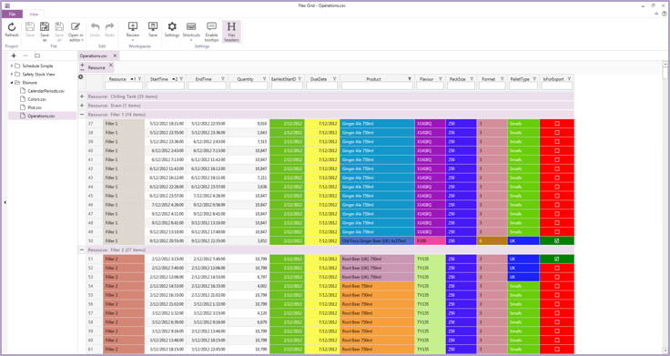

#1	Introduction
[WildGums](http://www.wildgums.com/) developed Flex Grid to empower people working with CSV files. 

## Origin 
At WildGums, we had been working with CSV files for many years before developing Flex Grid. 
To highlight information in our CSV files, we used to open them in Excel and then add formatting, filters, sorts, and more. 
But CSV files don't store any formatting information, so whenever we exported our Excel files to CSV format and sent them out, we would need to reapply all the formatting on the CSV files that we got back. 

We started looking for a simple way to make the information in our CSV files come to life. 
We looked at what was available on the market and found a distinct lack of applications that could provide the features we were looking for. 
We found plenty of great tools for editing CSV files, but none that empowered users to explore the information contained in the file itself. 
In typical WildGums fashion, we decided to build such an application ourselves.

##What Flex Grid Does
Flex Grid allows you to add formatting, filters, sorts, and more to CSV files.  
With Flex Grid, you can quickly and easily turn this:

Into this:

##What Flex Grid Does Not Do 
Flex Grid does not aim to be a fully featured utility for editing the content of CSV files. 
There are many good programs, such as Notepad++, that already serve this purpose.