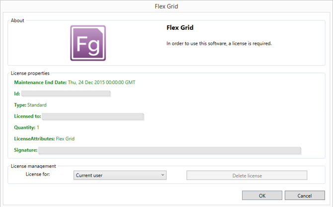

#3	Getting Started
##3.1	Hardware Requirements
- Framework: .NET 4.5
- CPU: 1.7 GHz
- RAM: 2 GB

##3.2	Installation
This program requires a license. 
Your solution provider should send you an email containing your license key, which you will need to enter during the installation process.

- Double click on the installation file.

- After a few moments, the following box will appear:

- Click on the play symbol.
- After a few moments, the following license prompt will appear:

- Copy the license text from the email from your solution provider. 
- Click on the 'Paste' button. 
 

- If you have entered a valid license, the following message will appear:

- Click 'OK' to continue to the Flex Grid application. When Flex Grid first opens, you will see the following: 

##3.3	Installation Defaults

By default, Flex Grid is installed in the following directory: 

	C:\Users\[username]\AppData\Local\Flex Grid

By default, workspaces and settings files are saved in the following directory: 
 
	C:\Users\[username]\AppData\Roaming\Wild Gums\Flex Grid