#4	Layout
The Flex Grid workspace contains three main areas:

1. Toolbar and menus
2. Navigation area
3. Data area

Each of these are discussed in subsequent sections of documentation. 

#5 Navigation
##5.1 Navigation Menu

 

The three main components of the navigation menu are the following: 

- Folder maintenance area: This area contains buttons for adding a folder, removing a folder, and browsing folder selections. 

- Folder tree area: This area displays CSV files in folders that have been added. 

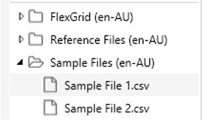

- Show/Hide button: This button is a toggle for displaying the navigation area.

 
##5.2	Folders
###5.2.1	Add a Folder

To add a folder to the folder tree area: 

1. Click the 'Add Folder' button  (the plus sign) in the folder maintenance area. 
2. A file browser window will open so that you can select the folder to open. 
3. Once you have selected a folder, click the 'Select Folder' button.

The folder will then appear in the folder tree area.

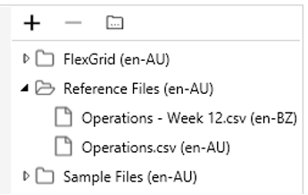
 
###5.2.2	Remove a Folder

 

To remove a folder from the folder tree area:

1. Select the folder in the folder tree area.
2. Click the 'Remove Folder' button (the minus sign) in the folder maintenance area. A prompt pop up to confirm that you want to remove the folder. 
3. Click 'Yes', and the folder will be removed. 

 
###5.2.3	Browse an Added Folder in Windows Explorer

To view a folder in the file browser: 

1. Click on a folder in the folder tree area (i.e., a folder that has already been added) to select it. 
2. Click the 'Open in File Browser' button in the folder maintenance area. File Explorer open and display contents of the selected folder. 

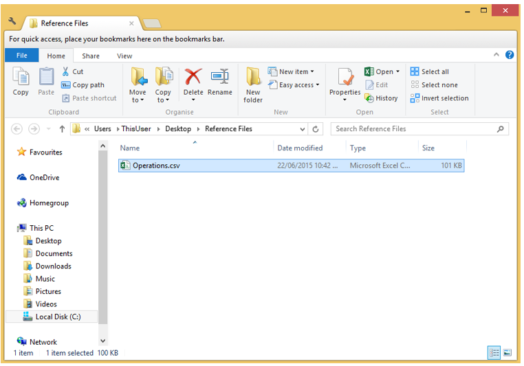

###5.3	Open a File 
By default, folders in the folder tree area collapsed, so their contents are hidden.

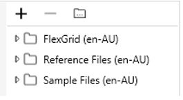
 
To expand a folder, click on the arrow to the left of the name of the folder. 
The folder will expand to show its CSV files and sub-folders. 

 
Note: To collapse a folder, simply click the arrow to the left of the name of the folder: 

To open a CSV file, double-click on it. 
The file will open in the data area. 

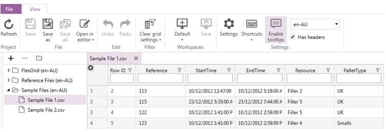

If you are opening a file for the first time, a window will pop up asking you to set the culture (language). 
Select the desired culture from the drop-down list. 
The default value is Australian English (en-AU).

 
You can have multiple files open at the same time. 
Each file will open into a new tab in the data area. 

 
###5.4	Closing a File

To close a file, click the 'x' on the right side of the file's tab: 

#6 Toolbar and Menus

#6.1 File Menu

 

###6.1.1	Open
Opens the selected CSV file. 
You can select from a list of recent documents or browse the computer.

###6.1.2	Save
Saves the current CSV file.

###6.1.3	Save As
Prompts you to enter a new filename and select the directory to save the CSV file in. 
After doing so, click 'Save' to save the current CSV file. 

###6.1.4	Support
Display product information (i.e., license details) and support options. 

####6.1.4.1	Product Information
This section displays the current license holder, the license type, and the maintenance expiration date. 
This information may be required by support personnel.  

 

####6.1.4.2		Support Option: Support Package
The following button creates a support package file (SPKG) that helps engineers troubleshoot problems in the selected folder. 
 
 

This file contains the following: 

1. License details 
2. Workspace files for recently used CSV files
3. System specifications, including the operating system, CPU, memory, .NET versions, and log files

After clicking this button, a reminder will pop up stating that the file may contain sensitive information. 
Click 'I understand, create the support package' to proceed. 

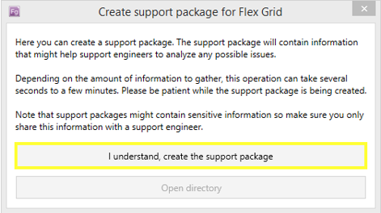 
 
After creating the file, click the 'Open Directory' button to locate the file and forward it to support personnel. 

 
 
####6.1.4.3		Support Option: Fix It
Click this button to run a small application that attempts to resolve any issues (e.g., corrupt workspaces and settings files). 

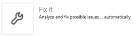

####6.1.4.4		Support Option: Feedback 
Click this button to open the Simply Effective Solutions feedback portal. 

 
In the feedback portal, you can provide feedback and browse knowledge base entries.

 
####6.1.4.5		Support Option: About
 Click this button to display information about your version of Flex Grid in a new window. 

 
The window that pops up also provides easy access to the log file via the 'Show log...' button.  

 

####6.1.4.6		Support Option: System Info
Click this button to display the current system specifications in a new window. 

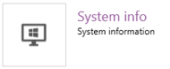
 
To copy the system specifications (e.g., so that you can forward them to support personnel), click the 'Copy' button in the window that pops up. 

 
####6.1.4.7		Support Option: Updates
Click this button to check for updates on the Update Channel stream. 

 
####6.1.4.8		Support Option: Log Info
Click this button to open a new window with log information. 

 
From the log information window, you can filter the types of log entries that will be displayed. 
To toggle a log type on or off, click on its name in the top left of the log information window. 

 

##6.2	Toolbar Tools
The following screenshot shows the toolbar. 

 
 
###6.2.1	Project 
 The 'Project' section of the toolbar contains the 'Refresh' button. 
Click the 'Refresh' button to reload the current CSV file. 
If the 'Enable automatic refresh on project files change' setting is turned on, you will not need to manually reload the file with this button. 
Change this setting by clicking on the 'Settings' button (under 'Settings' on the toolbar) and clicking the box next to 'Enable automatic refresh on project files change'. 

###6.2.2	File 
The 'File' section of the toolbar contains the following buttons: 

- Save: Saves the current CSV file, overwriting the existing file. You can only use this button if the current file has unsaved changes. 

- Save as: Prompts you to enter a new filename and select the directory to save the CSV file in. After doing so, click 'Save' to save the current CSV file. 

 
 
- Save all: Saves all CSV files that are currently open, overwriting the original files.

- Open in editor: Opens the current CSV file in a separate application for editing. The default editor application is WordPad. Change the editor application by clicking on the 'Settings' button (under 'Settings' on the toolbar) and changing the 'External editor path' so that it points to your preferred application. 

###6.2.3	Edit
The 'Edit' section of the toolbar contains the following buttons: 

 

- Undo: Undoes the last action. There is no limit to the number of actions that can be undone. You can only use this button if the current file has been changed. 

- Redo: Reverses the effect of using the 'Undo' button. There is no limit to the number of actions that can be redone. 

###6.2.4	Workspaces

####6.2.4.1 Manage Workspaces
Use the first button in the 'Workspaces' toolbar to manage workspaces. 

To create a workspace, click on the top half of this button. 
The 'Create new workspace' dialog will pop up. 
Enter a name for the workspace, and click 'OK'. 

 

For access to additional commands for managing workspaces, click the lower half of this button. 
A list will pop up that allows you to do any of the following: 

1.	Select a workspace: Click on the name of the workspace. 
2.	Rename a workspace: Click the 'Edit' button next to the name of the workspace you want to rename.

3.	Delete a workspace: Click the 'Delete' button next to the name of the workspace you want to delete. 

 

####6.2.4.1 Save 
After creating a workspace, you can save your formatting other changes (e.g., ordering, sorting, and column visibility) to the workspace. 
To do so, click the 'Save' button. 

###6.2.5	Settings
The 'Settings' section of the toolbar contains the following buttons:

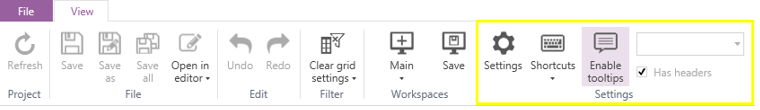 

####6.2.5.1 Settings 
Click the 'Settings' button to customise the application and its behaviour. 

A window will pop up where you can manage the application settings. 
Under 'Application settings', the following options are available: 

 
- Remember last project: Toggles whether to open the previously viewed file automatically when Flex Grid opens

- Show row ID: Toggles whether to display the row number in CSV files. This setting is handy when using sorts or filters. 

- External editor path: Determines which application to use when opening a CSV file in an external editor. The default editor application is WordPad. To change the external editor application, click on the 'Browse for editor' button (shown below) and navigate to the path of the application you would prefer to use. 

- Enable quick filters: Toggles the display of quick filters at the top of each column. Enter text in a quick filter to hide data that does not match. 

**Without quick filters enabled**
 

**With quick filters enabled**
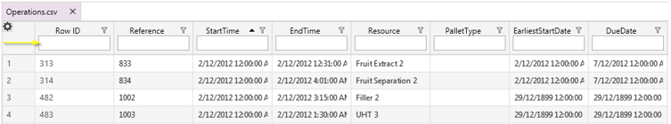

**Example of quick filter results**
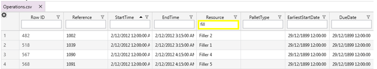

- Enable anonymous analytics to improve this application: Toggles the collection of anonymous data about which features are in use so that the application can be improved.

- Enable automatic refresh when project files change: Toggles whether to automatically update the data displayed in Flex Grid when another application makes changes to the file in use. If this setting is on and the file changes, the following prompt will appear: 

Under 'Automatic updates', the following options are available:

- Automatically install new updates: Toggles whether to automatically apply updates when they are released. 

- Update channel: Determines where to get updates if they will be applied automatically. There are three types of updates: 
  * Stable: Releases that have been through rigorous beta testing both internally and by external users. Stable releases are the safest to use. 
  * Beta: Releases that have recent fixes or enhancements and have been through internal testing. Beta releases are not as safe as stable releases, but more safe than alpha releases. 
  * Alpha: Releases that have recent fixes or enhancements and are currently in internal testing. Alpha releases are the least stable. 

Under 'User data options', the following options are available:

 
- Open data directory...: Opens the directory that stores the log files, filters, and workspace settings files.

- Create user data backup: Creates a compressed file (ZIP) of the data directory to make it easy to restore filters and workspaces.

- Reset workspaces: Deletes all custom workspaces. 

####6.2.5.2 Shortcuts 
Click the top or bottom half of the 'Shortcuts' button to view and manage keyboard bindings. 
To quickly view existing shortcuts, click the bottom half of the icon. 

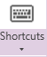

A list will drop down showing the shortcuts and their key bindings. 

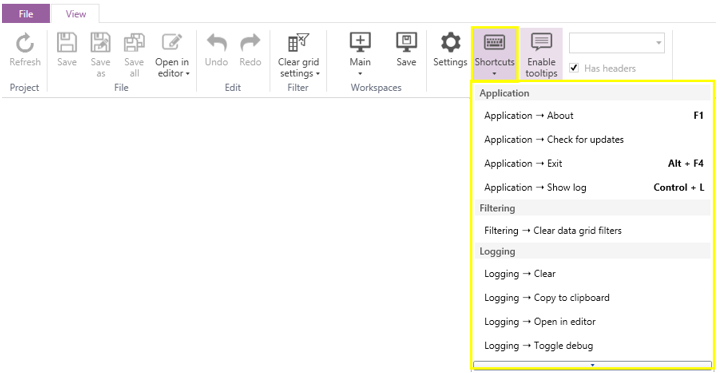

These shortcuts can be modified by clicking the top half of the 'Shortcuts' button, which opens the 'Keyboard shortcuts' window. 

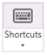

From the 'Keyboard shortcuts' window (shown below), you can search for shortcuts, modify existing shortcuts, and make new shortcuts. 

To search for shortcuts, type your search text into the text box at the top of the window. 
If you click on a shortcut, you can do any of the following: 

- Clear existing key bindings for the shortcut: Click the 'Remove' button. 
- Add a shortcut or modify an existing shortcut: Click in the text box next to 'Press shortcut keys'. Then, press the keys you want to bind to the shortcut. For example, hold CTL + SHIFT + C to bind those keys to a shortcut. Finally, click the 'Assign' button. 

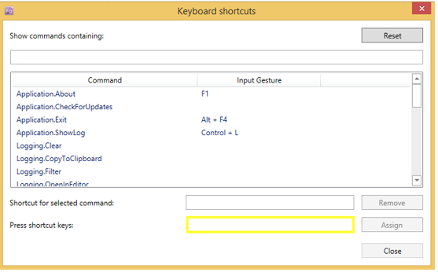 

####6.2.5.3 Enable Tooltips

This setting toggles whether to display tips when the cursor hovers over a cell. 

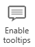

A tooltip contains all the row data for the cell that the mouse is hovering over, and the text in the tooltip has the same format and alignment as the data itself.  
 
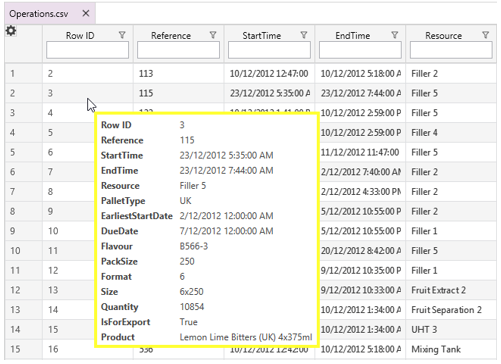

####6.2.5.4 Language Settings
The language of the current file is shown in the rightmost portion of the 'Settings' section of the toolbar. 

You will have set the language the first time you opened the file in Flex Grid. 
You can select a different language from the drop-down menu. 

####6.2.5.5 Has Headers
This option determines whether Flex Grid will treat the current CSV file as having a row of headers or not. 

When this option is on, the first row of the CSV file will be displayed as field headers in the data grid area. 

**File with header row**

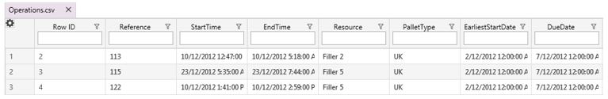

**File without header row**

##7	Data Grid 
The data grid area displays the contents of CSV files. 
Each file is displayed in its own tab, so you can easily switch between files.

###7.1	Sorts
Data grid results can be sorted in ascending or descending order, and multiple sorts can be applied at the same time. 
Left-click on a column header to step through the sort options: 

1. No sort
2. Ascending order

3. Descending order 

 

To apply multiple sorts, hold the control key down while clicking on the header of a different column. 
There is no limit to the number of sorts that can be applied, so you can hold the control and continue clicking on columns to sort them simultaneously. 
 
The following screenshot shows the result clicking once on the 'Flavour' column header.

 
Below is the result of two clicks on the 'Flavour' column header. 

 
The next example shows the result of adding an additional sort to the 'Resource' column by holding the control key and clicking once on the 'Resource' column header. 

 
Notice that when multiple sorts are active, their priority is displayed as a number in the column header. 

##7.2	Filters

###7.2.1 Drop-Down Filters
To use a drop-down filter, click the filter icon (shaped like a funnel) in the column header. 

 
 
A filter menu will drop down. 
The filter menu shows the number of rows with each value in the column and provides a checkbox to toggle rows with each value on or off. 

A search box appears at the top of the filter menu. 
Type in the search box to restrict which filters appear in the filter menu. 

**Unfiltered results**

					

**Result filtered by search box entry**

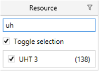					

The 'Toggle selection' option provides selects or deselects all results in the column.

**Toggle selection on**

					

**Toggle selection off**

 
###7.2.2	Quick Filters
Quick filters are optional and must be enabled. 
To enable quick filters, click on the 'Settings' button in the toolbar area. 
Under 'Application settings', the 'Enable quick filters' checkbox toggles this option. 

When quick filters are enabled, column headers contain a search box.

Text in the search box refines results in the data grid. 
The following screenshot shows the result of typing 'uh' in the 'Resource' column quick filter. 

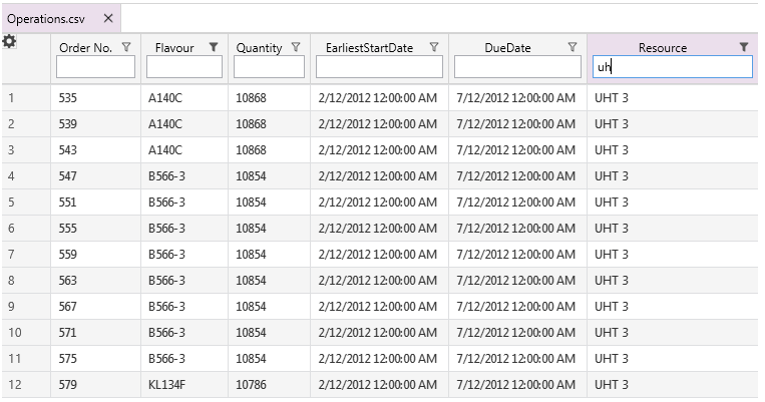
 
##7.3	Groups
Groups are helpful when reviewing data, and there is no limit to the number of groups that can be added. 

###7.3.1 Add a Group
To add a column to a group, right-click on the column's header and select 'Add to Group'. 

By default, the grouping results will be expanded for each group. 
For example, adding the 'Resource' column to a group results in the following: 

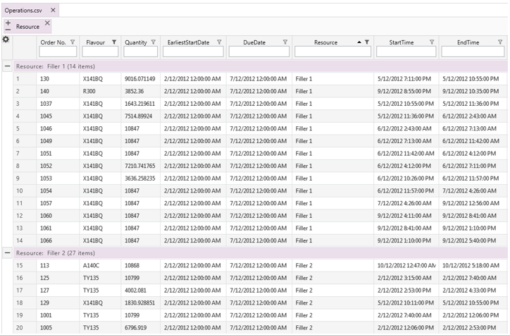
 
Notice that 'Resource' has been added to the grouping summary area and summary rows identify the rows in each group. 

 
Adding an additional group for the 'Flavour' column results in the following: 

###7.3.2 Expand or Collapse Groups 
The tab for each group in the grouping summary area contains buttons for expanding and collapsing the group. 
Click the plus sign to expand the group and the minus sign to collapse it. 

 
Clicking the collapse button on the 'Resource' group results in the following: 

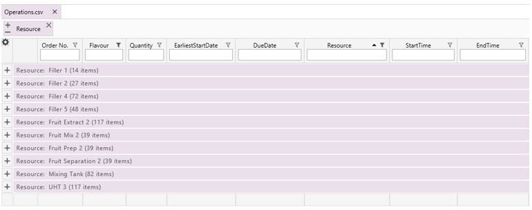
 
Alternatively, clicking the expand button will expand the groups as shown below.

 

To selectively expand or collapse portions of a group, use the plus and minus sign buttons in the summary row. 

###7.3.3 Remove a Group
Remove a group by clicking the 'x' in group's tab in the grouping summary area. 

 

##7.4	Colour Columns
Adding colours to columns can provide useful information about data at a glance. 

###7.4.1 Add Colour
To add colour to a column, right-click on the column header and select 'Add Colors' from the list. 
There is no limit to the number of columns that can have colours.

 
###7.4.2 Remove Colours
To remove colour from a column, right-click on the column header and select 'Remove Colors' from the list.
 
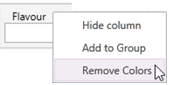 

###7.5	Data Grid Settings
Use the data grid settings to customise how data are displayed in the data area.
To modify data grid settings, click the cog icon in the top-left corner of the data grid area. 
A new window will open (shown below).

The following elements can be customised:

- Alignment: Changes the text alignment 

- CanBeMoved: Determines whether columns can be reordered. Moving related columns next to each other is useful when creating custom groups. To move a column, click and drag the column header to its new location. For example, the following screenshots show the process of dragging the 'Product' column to the other side of the 'Due Date' column:

**Before dragging and dropping the 'Product' column**
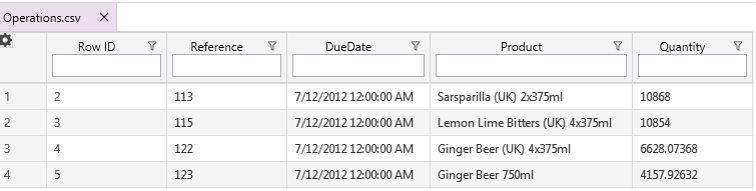
 
**While dragging and dropping the 'Product' column**

 
**After dragging and dropping the 'Product' column**
 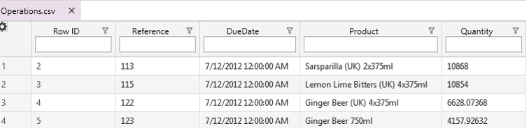

- CanEdit: Determines whether a field can be edited. To edit a field, double-click in it to get focus and then update the contents. 

**Text/Numeric fields**

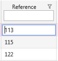

**Date/Time fields**

- DisplayName: Sets or changes the column header

**'Reference' column DisplayName setting (data grid settings)**

 
**'Reference' column header (data grid)**

**Changing 'Reference' DisplayName to 'order#' (data grid settings)**
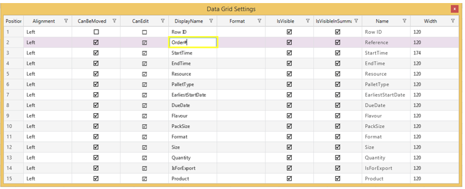
 
**Updated column header (data grid)**
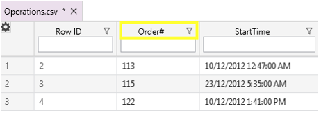

- Format: Format date/time fields (e.g., by selecting the locale or omitting time from date-only entries)

**'DueDate' column with no formatting applied (data grid)**

**Setting the date format for the 'DueDate' column (data grid settings)**
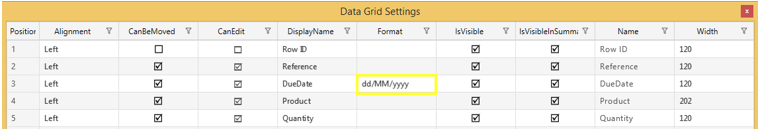
 
**Updated display of 'DueDate' column (data grid)**

 
- IsVisible: Toggles whether to show or hide the column in the data grid area

**'Row ID' column is visible (data grid)**
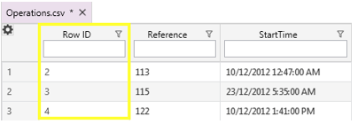
 
**Hiding the 'Row ID' column (data grid settings)**

**'Row ID' column is hidden (data grid)**
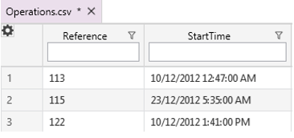

- Name: Displays the column name from the source file, which is useful when the display name has been updated. This cannot be modified.

- Width: Displays the column width. The width cannot be changed through the data grid settings; to change the width, go to the data grid area and drag the edge of the column header. 