#5 Navigation
##5.1 Navigation Menu

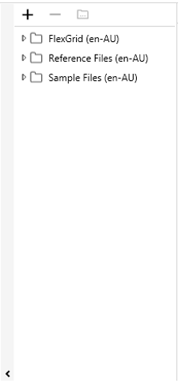 

The three main components of the navigation menu are the following: 

- Folder maintenance area: This area contains buttons for adding a folder, removing a folder, and browsing folder selections. 

- Folder tree area: This area displays CSV files in folders that have been added. 

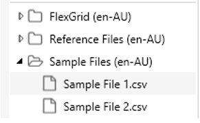

- Show/Hide button: This button is a toggle for displaying the navigation area.

 
##5.2	Folders
###5.2.1	Add a Folder

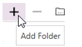

To add a folder to the folder tree area: 

1. Click the 'Add Folder' button  (the plus sign) in the folder maintenance area. 
2. A file browser window will open so that you can select the folder to open. 
3. Once you have selected a folder, click the 'Select Folder' button.

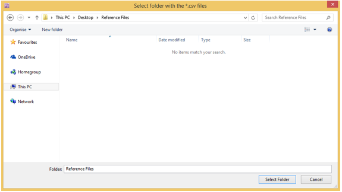

The folder will then appear in the folder tree area.

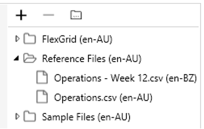
 
###5.2.2	Remove a Folder

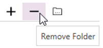 

To remove a folder from the folder tree area:

1. Select the folder in the folder tree area.
2. Click the 'Remove Folder' button (the minus sign) in the folder maintenance area. A prompt pop up to confirm that you want to remove the folder. 
3. Click 'Yes', and the folder will be removed. 

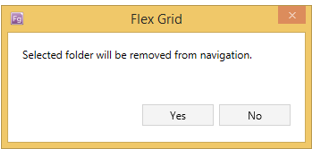
 
###5.2.3	Browse an Added Folder in Windows Explorer

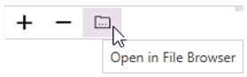

To view a folder in the file browser: 

1. Click on a folder in the folder tree area (i.e., a folder that has already been added) to select it. 
2. Click the 'Open in File Browser' button in the folder maintenance area. File Explorer open and display contents of the selected folder. 

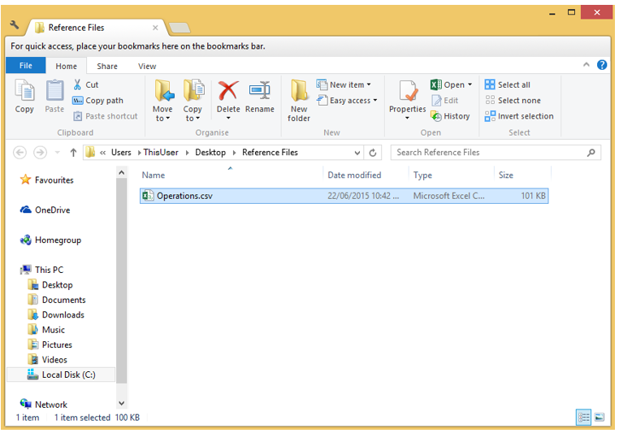

###5.3	Open a File 
By default, folders in the folder tree area collapsed, so their contents are hidden.

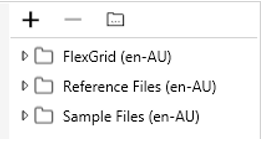
 
To expand a folder, click on the arrow to the left of the name of the folder. 
The folder will expand to show its CSV files and sub-folders. 

 
Note: To collapse a folder, simply click the arrow to the left of the name of the folder: 

To open a CSV file, double-click on it. 
The file will open in the data area. 

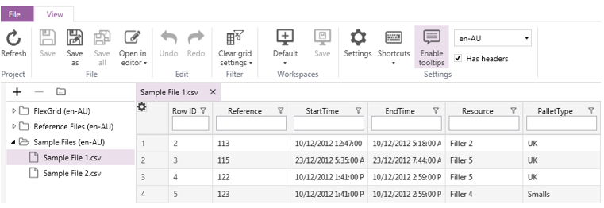

If you are opening a file for the first time, a window will pop up asking you to set the culture (language). 
Select the desired culture from the drop-down list. 
The default value is Australian English (en-AU).

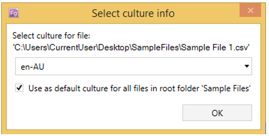
 
You can have multiple files open at the same time. 
Each file will open into a new tab in the data area. 

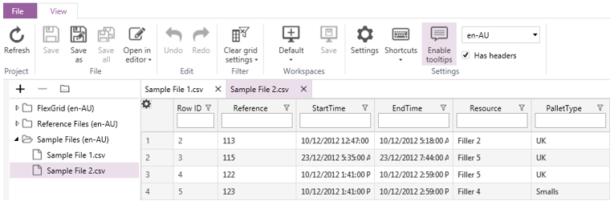
 
###5.4	Closing a File

To close a file, click the 'x' on the right side of the file's tab: 

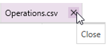