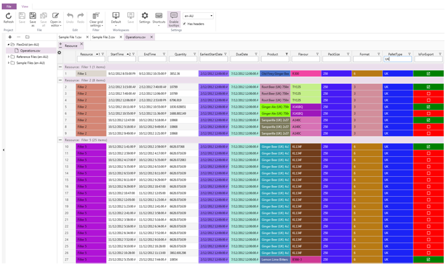
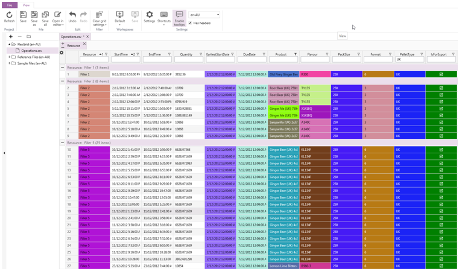

#5	Working with Data Files
##5.1	Finding Anomalies
Because of the ability to quickly add colour coding, Flex Grid is great for finding issues with your data. 
The table below contains shipping information for a company that sells soda, sometimes internationally. 
Take a look at the table and see whether you can quickly identify any anomalies in the data.

 
You probably weren't able to, but with Flex Grid, you can format the data in a few seconds to make anomalies stand out. 

 
 
After adding colours, you can easily see that there are a couple shipments that require UK export pallets but have not been flagged as export jobs. 
These anomalies are not only easy to spot in Flex Grid but they are also easy to fix because Flex Grid lets you quickly perform basic edits on CSV files. 
The following steps illustrate how to identify and fix anomalies in this example: 

- First, add a quick filter to show all the products that require a UK pallet. 

 
- Then, add another quick filter to show which of these jobs are not flagged as export jobs.

 
Next, simply click on the check boxes in the 'IsForExport' column for the jobs that should be flagged for export. 
After checking the box, the value for that row will be set to 'True'. 

