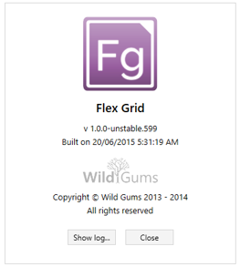
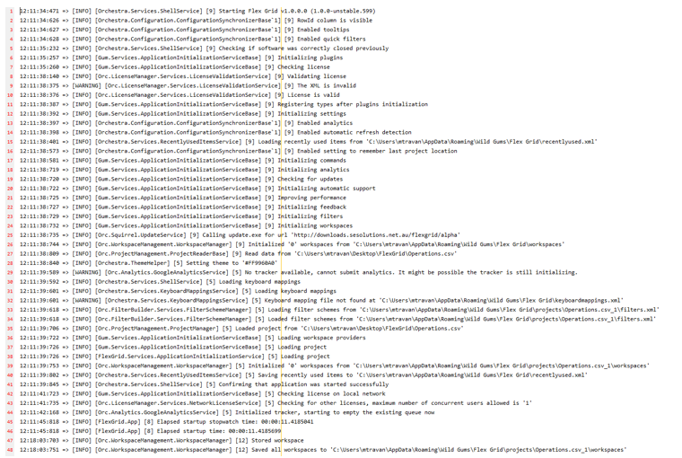
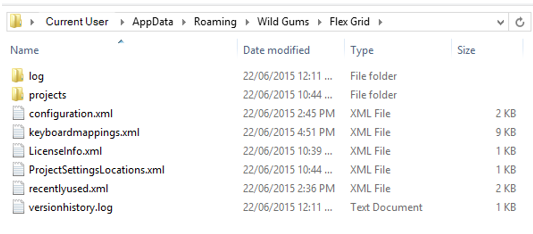

#6	Logs

Two types of logs are available:

1. Event logs
2. Crash reports

##6.1	Event Log
The event log records actions within Flex Grid and the locations of filter and workspace settings files. 
To access the event log, open the 'About' dialog by clicking on the question mark icon in the top-right corner of the window. 

The 'About' dialog will pop up. 

In the 'About' dialog, click the 'Show log ...' button. 

Below is an example of an event log.

##6.2	Crash Reports
Crash reports provide details about Flex Grid errors that crashes the application. 
Crash reports are in files with names that are prefixed with 'Crashreport_' followed by the current date (i.e., 'Crashreport_yyyymmdd.txt.log'). 
These files can be located in the following directory:

    C:\Users\[username]\AppData\Roaming\Wild Gums\Flex Grid

The following image shows the location and contents of this folder when there are no crash reports present: 

