#6 Toolbar and Menus

#6.1 File Menu

 

###6.1.1	Open
Opens the selected CSV file. 
You can select from a list of recent documents or browse the computer.

###6.1.2	Save
Saves the current CSV file.

###6.1.3	Save As
Prompts you to enter a new filename and select the directory to save the CSV file in. 
After doing so, click 'Save' to save the current CSV file. 

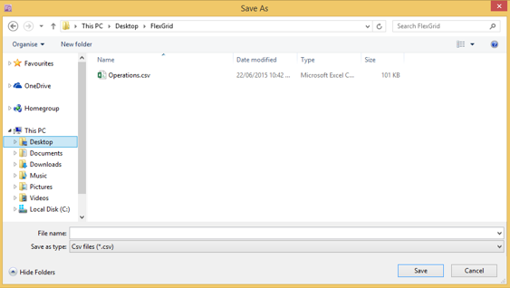

###6.1.4	Support
Display product information (i.e., license details) and support options. 

####6.1.4.1	Product Information
This section displays the current license holder, the license type, and the maintenance expiration date. 
This information may be required by support personnel.  

 

####6.1.4.2		Support Option: Support Package
The following button creates a support package file (SPKG) that helps engineers troubleshoot problems in the selected folder. 
 
 

This file contains the following: 

1. License details 
2. Workspace files for recently used CSV files
3. System specifications, including the operating system, CPU, memory, .NET versions, and log files

After clicking this button, a reminder will pop up stating that the file may contain sensitive information. 
Click 'I understand, create the support package' to proceed. 

 
 
After creating the file, click the 'Open Directory' button to locate the file and forward it to support personnel. 

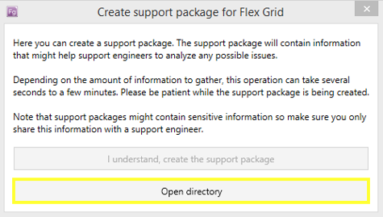 
 
####6.1.4.3		Support Option: Fix It
Click this button to run a small application that attempts to resolve any issues (e.g., corrupt workspaces and settings files). 

####6.1.4.4		Support Option: Feedback 
Click this button to open the Simply Effective Solutions feedback portal. 

 
In the feedback portal, you can provide feedback and browse knowledge base entries.

 
####6.1.4.5		Support Option: About
 Click this button to display information about your version of Flex Grid in a new window. 

 
The window that pops up also provides easy access to the log file via the 'Show log...' button.  

 

####6.1.4.6		Support Option: System Info
Click this button to display the current system specifications in a new window. 

 
To copy the system specifications (e.g., so that you can forward them to support personnel), click the 'Copy' button in the window that pops up. 

 
####6.1.4.7		Support Option: Updates
Click this button to check for updates on the Update Channel stream. 

 
####6.1.4.8		Support Option: Log Info
Click this button to open a new window with log information. 

 
From the log information window, you can filter the types of log entries that will be displayed. 
To toggle a log type on or off, click on its name in the top left of the log information window. 

 

##6.2	Toolbar Tools
The following screenshot shows the toolbar. 

 
 
###6.2.1	Project 
 The 'Project' section of the toolbar contains the 'Refresh' button. 
Click the 'Refresh' button to reload the current CSV file. 
If the 'Enable automatic refresh on project files change' setting is turned on, you will not need to manually reload the file with this button. 
Change this setting by clicking on the 'Settings' button (under 'Settings' on the toolbar) and clicking the box next to 'Enable automatic refresh on project files change'. 

###6.2.2	File 
The 'File' section of the toolbar contains the following buttons: 

- Save: Saves the current CSV file, overwriting the existing file. You can only use this button if the current file has unsaved changes. 

- Save as: Prompts you to enter a new filename and select the directory to save the CSV file in. After doing so, click 'Save' to save the current CSV file. 

 
 
- Save all: Saves all CSV files that are currently open, overwriting the original files.

- Open in editor: Opens the current CSV file in a separate application for editing. The default editor application is WordPad. Change the editor application by clicking on the 'Settings' button (under 'Settings' on the toolbar) and changing the 'External editor path' so that it points to your preferred application. 

###6.2.3	Edit
The 'Edit' section of the toolbar contains the following buttons: 

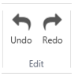 

- Undo: Undoes the last action. There is no limit to the number of actions that can be undone. You can only use this button if the current file has been changed. 

- Redo: Reverses the effect of using the 'Undo' button. There is no limit to the number of actions that can be redone. 

###6.2.4	Workspaces

####6.2.4.1 Manage Workspaces
Use the first button in the 'Workspaces' toolbar to manage workspaces. 

To create a workspace, click on the top half of this button. 
The 'Create new workspace' dialog will pop up. 
Enter a name for the workspace, and click 'OK'. 

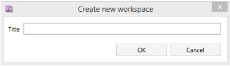 

For access to additional commands for managing workspaces, click the lower half of this button. 
A list will pop up that allows you to do any of the following: 

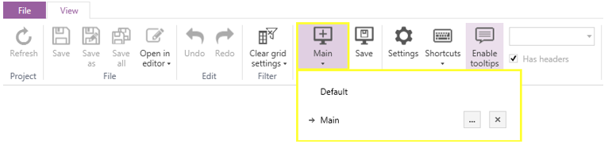

1.	Select a workspace: Click on the name of the workspace. 
2.	Rename a workspace: Click the 'Edit' button next to the name of the workspace you want to rename.

3.	Delete a workspace: Click the 'Delete' button next to the name of the workspace you want to delete. 

 

####6.2.4.1 Save 
After creating a workspace, you can save your formatting other changes (e.g., ordering, sorting, and column visibility) to the workspace. 
To do so, click the 'Save' button. 

###6.2.5	Settings
The 'Settings' section of the toolbar contains the following buttons:

 

####6.2.5.1 Settings 
Click the 'Settings' button to customise the application and its behaviour. 

A window will pop up where you can manage the application settings. 
Under 'Application settings', the following options are available: 

 
- Remember last project: Toggles whether to open the previously viewed file automatically when Flex Grid opens

- Show row ID: Toggles whether to display the row number in CSV files. This setting is handy when using sorts or filters. 

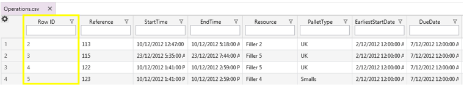

- External editor path: Determines which application to use when opening a CSV file in an external editor. The default editor application is WordPad. To change the external editor application, click on the 'Browse for editor' button (shown below) and navigate to the path of the application you would prefer to use. 

- Enable quick filters: Toggles the display of quick filters at the top of each column. Enter text in a quick filter to hide data that does not match. 

**Without quick filters enabled**
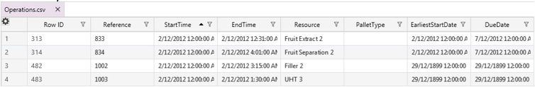 

**With quick filters enabled**

**Example of quick filter results**

- Enable anonymous analytics to improve this application: Toggles the collection of anonymous data about which features are in use so that the application can be improved.

- Enable automatic refresh when project files change: Toggles whether to automatically update the data displayed in Flex Grid when another application makes changes to the file in use. If this setting is on and the file changes, the following prompt will appear: 

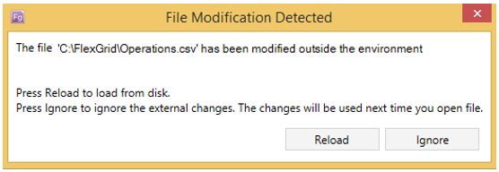

Under 'Automatic updates', the following options are available:

- Automatically install new updates: Toggles whether to automatically apply updates when they are released. 

- Update channel: Determines where to get updates if they will be applied automatically. There are three types of updates: 
  * Stable: Releases that have been through rigorous beta testing both internally and by external users. Stable releases are the safest to use. 
  * Beta: Releases that have recent fixes or enhancements and have been through internal testing. Beta releases are not as safe as stable releases, but more safe than alpha releases. 
  * Alpha: Releases that have recent fixes or enhancements and are currently in internal testing. Alpha releases are the least stable. 

Under 'User data options', the following options are available:

 
- Open data directory...: Opens the directory that stores the log files, filters, and workspace settings files.

- Create user data backup: Creates a compressed file (ZIP) of the data directory to make it easy to restore filters and workspaces.

- Reset workspaces: Deletes all custom workspaces. 

####6.2.5.2 Shortcuts 
Click the top or bottom half of the 'Shortcuts' button to view and manage keyboard bindings. 
To quickly view existing shortcuts, click the bottom half of the icon. 

A list will drop down showing the shortcuts and their key bindings. 

These shortcuts can be modified by clicking the top half of the 'Shortcuts' button, which opens the 'Keyboard shortcuts' window. 

From the 'Keyboard shortcuts' window (shown below), you can search for shortcuts, modify existing shortcuts, and make new shortcuts. 

To search for shortcuts, type your search text into the text box at the top of the window. 
If you click on a shortcut, you can do any of the following: 

- Clear existing key bindings for the shortcut: Click the 'Remove' button. 
- Add a shortcut or modify an existing shortcut: Click in the text box next to 'Press shortcut keys'. Then, press the keys you want to bind to the shortcut. For example, hold CTL + SHIFT + C to bind those keys to a shortcut. Finally, click the 'Assign' button. 

 

####6.2.5.3 Enable Tooltips

This setting toggles whether to display tips when the cursor hovers over a cell. 

A tooltip contains all the row data for the cell that the mouse is hovering over, and the text in the tooltip has the same format and alignment as the data itself.  
 

####6.2.5.4 Language Settings
The language of the current file is shown in the rightmost portion of the 'Settings' section of the toolbar. 

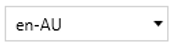

You will have set the language the first time you opened the file in Flex Grid. 
You can select a different language from the drop-down menu. 

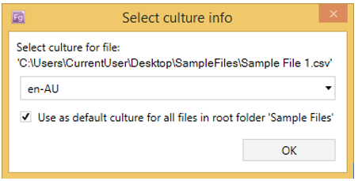

####6.2.5.5 Has Headers
This option determines whether Flex Grid will treat the current CSV file as having a row of headers or not. 

When this option is on, the first row of the CSV file will be displayed as field headers in the data grid area. 

**File with header row**

**File without header row**
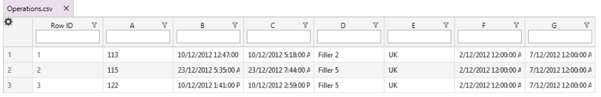