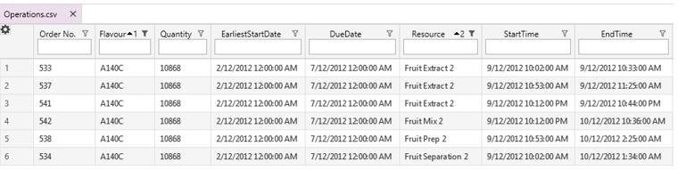
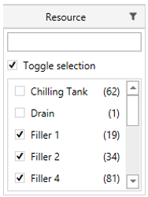
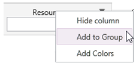
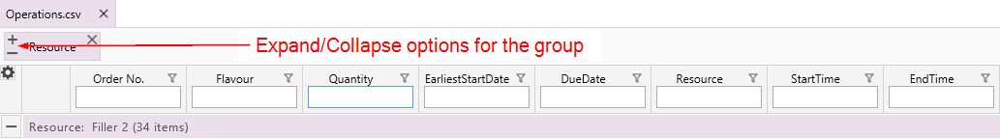
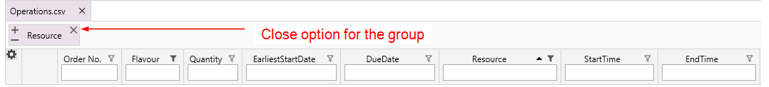
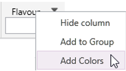
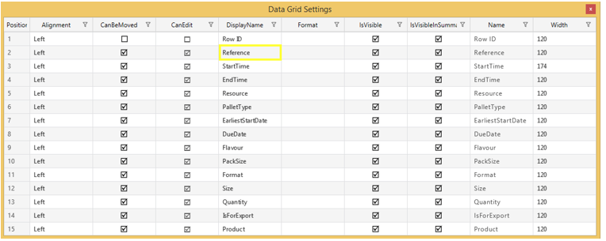
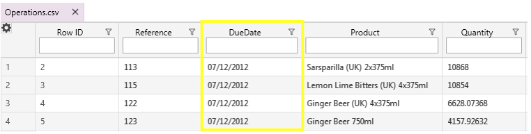

##7	Data Grid 
The data grid area displays the contents of CSV files. 
Each file is displayed in its own tab, so you can easily switch between files.

###7.1	Sorts
Data grid results can be sorted in ascending or descending order, and multiple sorts can be applied at the same time. 
Left-click on a column header to step through the sort options: 

1. No sort
2. Ascending order

3. Descending order 

 

To apply multiple sorts, hold the control key down while clicking on the header of a different column. 
There is no limit to the number of sorts that can be applied, so you can hold the control and continue clicking on columns to sort them simultaneously. 
 
The following screenshot shows the result clicking once on the 'Flavour' column header.

 
Below is the result of two clicks on the 'Flavour' column header. 

 
The next example shows the result of adding an additional sort to the 'Resource' column by holding the control key and clicking once on the 'Resource' column header. 

 
Notice that when multiple sorts are active, their priority is displayed as a number in the column header. 

##7.2	Filters

###7.2.1 Drop-Down Filters
To use a drop-down filter, click the filter icon (shaped like a funnel) in the column header. 

 
 
A filter menu will drop down. 
The filter menu shows the number of rows with each value in the column and provides a checkbox to toggle rows with each value on or off. 

A search box appears at the top of the filter menu. 
Type in the search box to restrict which filters appear in the filter menu. 

**Unfiltered results**

					

**Result filtered by search box entry**

					

The 'Toggle selection' option provides selects or deselects all results in the column.

**Toggle selection on**

					

**Toggle selection off**

 
###7.2.2	Quick Filters
Quick filters are optional and must be enabled. 
To enable quick filters, click on the 'Settings' button in the toolbar area. 
Under 'Application settings', the 'Enable quick filters' checkbox toggles this option. 

When quick filters are enabled, column headers contain a search box.

Text in the search box refines results in the data grid. 
The following screenshot shows the result of typing 'uh' in the 'Resource' column quick filter. 

 
##7.3	Groups
Groups are helpful when reviewing data, and there is no limit to the number of groups that can be added. 

###7.3.1 Add a Group
To add a column to a group, right-click on the column's header and select 'Add to Group'. 

By default, the grouping results will be expanded for each group. 
For example, adding the 'Resource' column to a group results in the following: 

 
Notice that 'Resource' has been added to the grouping summary area and summary rows identify the rows in each group. 

 
Adding an additional group for the 'Flavour' column results in the following: 

###7.3.2 Expand or Collapse Groups 
The tab for each group in the grouping summary area contains buttons for expanding and collapsing the group. 
Click the plus sign to expand the group and the minus sign to collapse it. 

 
Clicking the collapse button on the 'Resource' group results in the following: 

 
Alternatively, clicking the expand button will expand the groups as shown below.

 

To selectively expand or collapse portions of a group, use the plus and minus sign buttons in the summary row. 

###7.3.3 Remove a Group
Remove a group by clicking the 'x' in group's tab in the grouping summary area. 

 

##7.4	Colour Columns
Adding colours to columns can provide useful information about data at a glance. 

###7.4.1 Add Colour
To add colour to a column, right-click on the column header and select 'Add Colors' from the list. 
There is no limit to the number of columns that can have colours.

 
###7.4.2 Remove Colours
To remove colour from a column, right-click on the column header and select 'Remove Colors' from the list.
 
 

###7.5	Data Grid Settings
Use the data grid settings to customise how data are displayed in the data area.
To modify data grid settings, click the cog icon in the top-left corner of the data grid area. 
A new window will open (shown below).

The following elements can be customised:

- Alignment: Changes the text alignment 

- CanBeMoved: Determines whether columns can be reordered. Moving related columns next to each other is useful when creating custom groups. To move a column, click and drag the column header to its new location. For example, the following screenshots show the process of dragging the 'Product' column to the other side of the 'Due Date' column:

**Before dragging and dropping the 'Product' column**

 
**While dragging and dropping the 'Product' column**

 
**After dragging and dropping the 'Product' column**
 

- CanEdit: Determines whether a field can be edited. To edit a field, double-click in it to get focus and then update the contents. 

**Text/Numeric fields**

**Date/Time fields**

- DisplayName: Sets or changes the column header

**'Reference' column DisplayName setting (data grid settings)**

 
**'Reference' column header (data grid)**

**Changing 'Reference' DisplayName to 'order#' (data grid settings)**

 
**Updated column header (data grid)**

- Format: Format date/time fields (e.g., by selecting the locale or omitting time from date-only entries)

**'DueDate' column with no formatting applied (data grid)**

**Setting the date format for the 'DueDate' column (data grid settings)**

 
**Updated display of 'DueDate' column (data grid)**

 
- IsVisible: Toggles whether to show or hide the column in the data grid area

**'Row ID' column is visible (data grid)**

 
**Hiding the 'Row ID' column (data grid settings)**

**'Row ID' column is hidden (data grid)**

- Name: Displays the column name from the source file, which is useful when the display name has been updated. This cannot be modified.

- Width: Displays the column width. The width cannot be changed through the data grid settings; to change the width, go to the data grid area and drag the edge of the column header. 