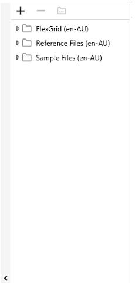
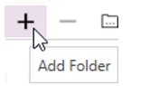
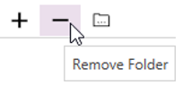
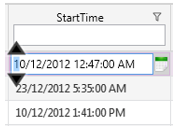

#1	Introduction
Our Flex Gird (FG) application was developed by WildGums to empower people working with CSV format files. We’ve worked with CSV files for many years and we were looking for a simple way of making the information contained in the csv files come to life.

In the past we would open the csv files in Excel and then add formatting, filters sorts etc. in order to highlight the information we needed. The problem with this is that csv files don’t store any formatting information and even if they did once you got a new copy of the csv file all that formatting information would be lost and would need to be applied again.

We took a look at what was available on the market and found a distinct lack of applications that provided us with the features we were looking for. We found plenty of great tools for manipulating csv files, but nothing that empowered a user to explore the information contained in the file itself. So in typical WildGums style we decided we could build one ourselves.

Flex Grid is the result of years of frustration working with csv files trying to get to the information locked up inside.
 

##What Flex Grid does
Flex Grid allows you to quickly and easily turns this:

Into this:

 

##What Flex Grid doesn’t do
Flex Grid isn’t intended to be a fully featured utility for manipulating or changing the content of csv files. There are lots of good programs available like Notepad ++ that already provide this functionality.
 
#2	General Features
- User friendly interface for reviewing csv files
- Auto detect column formats
- Quickly reformat data the way you want
- Group by any column
- Sort with a single click
- Add as many sort levels as you need
- Add colours for easy highlighting
- Easy row filters to focus on what's important
- Click and drag to re-order columns
- Hide columns you don’t need to see
- File chooser for frequent files
- Formatting and data are stored separately
- Workspaces save format settings for each file
- Remembers the last workspace for each file
- Easily switch between multiple files
- Open multiple files at once into separate tabs
- Launch Excel and load the file with one two clicks
- Load into your favourite editor
- Quickly open the folder containing the file
- Auto refresh if the underlying data changes
- Edit values directly in the cell

#3	Getting Started
##3.1	Prerequisites
- Framework: .NET 4.5
- CPU: 1.7 GHz
- RAM: 2 GB

##3.2	Installation
This program requires a license in order to operate. Your solution provider should have sent you an email containing your license key. This key will be needed during the installation process.

- Double click on the executable  
- After a few moments the following box will appear.

- Click on the play symbol to continue
- After a few moment the following license prompt will appear

- Copy the license text from the email provided by your supplier
- Click on the Paste box
 

- If you enter a valid licence the following message box will appear

- Click ok to continue to the Flex Grid application

Flex Grid is installed in:

	C:\Users\[username]\AppData\Local\Flex Grid

Workspaces and settings files are saved in
 
	C:\Users\[username]\AppData\Roaming\Wild Gums\Flex Grid

#4	Layout
The Flex Grid workspace contains three main areas:

1. Toolbar and Menus
2. Navigation
3. Data Area

##4.1	Toolbar and Menus
###4.1.1	Toolbar File Menu

 
####4.1.1.1	Open
Opens the selected csv file in Flex Grid, can select from list of Recent documents or browse the computer.

####4.1.1.2	Save
Saves the current CSV file, without the need to enter the filename or path.

####4.1.1.3	Save As
Saves the current CSV file, once the desired location and filename details have been completed in the file browser window.

####4.1.1.4	Support
Displays product information and support options, these include:
1.	License Details
2.	Support Package
3.	Fix It
4.	Feedback
5.	About
6.	System Info
7.	Updates
8.	Log Info

#####4.1.1.4.1	Product Information
The details of the current license holder, license type and maintenance expiry date are displayed in this tab, and can be used for reference if required by support personnel.

 
#####4.1.1.4.2	Support Options
There are many support options available within Flex Grid, these include:

######4.1.1.4.2.1	Support Package
 

Creates a Support Package Files (spkg) in the selected folder. This support package contains:

1. License Details of the machine that the package was created on
2. Recent csv workspace files (this is not the csv file itself rather the workspace that relates to the csv file)
3. System Specifications – Including operation system, CPU, memory, .Net versions and log files.

On selection a reminder that the package may contain sensitive information is displayed, select the ‘I understand, create the support package’ option.

 
 
Once the package has been create, use the Open Directory option to locate the file to forward onto your support personnel.

 
 
######4.1.1.4.2.2	Fix It
 

Is a small application which will attempt to resolve any issues, such as corrupt workspaces or settings files.

######4.1.1.4.2.3	Feedback

 
Opens the Simply Effective feedback portal. Here you can add feedback or browse exiting knowledge base entries.

 
######4.1.1.4.2.4	About

 
Displays the Flex Grid about box, which details the current Flex Grid version, and provides easy access to view the log file.

 
######4.1.1.4.2.5	System Info

 
Displays the current system specifications, that can be easily copied if need to forward onto support personnel.

 
######4.1.1.4.2.6	Updates

 
On selection will check for pending upgrades for the Update Channel stream the current system is on. 

######4.1.1.4.2.7	Log Info

 
Opens a Log Information window that provides a way to review the logs. The type of log entries can be filtered by selecting the level desired.

 

###4.1.2	Toolbar Tools
 
 
####4.1.2.1	Project
 
 
The refresh option, will reload the current file. This would only be required if the Enable automatic refresh on project file change’ option was not enabled in the Settings

####4.1.2.2	File
 

- Save – Saves the current project file, overwriting the existing file. This option will become available once there has been a change to the current project file.

- Save as – Saves the current project file, prompting for the desired location and filename.

 
 
- Save all – Saves all currently opened project files, overwriting the original files.

- Open in editor – this will open the currently selected project file in an editor application. By default the editor application is set to WordPad, however this can be modified to the preferred application in the Settings options.

####4.1.2.3	Edit
 

- Undo – On selection will undo the last step. There is no limit to the number of times the undo option is selected. This option will only become available when there has been a change to the file.

- Redo – Will redo a step that had previously been undone. There also no limit to the number of times this option is selected. 

####4.1.2.4	Workspaces
#####4.1.2.4.1	Creating Workspaces
By selecting the top section of the 1st icon   within the Workspace toolbar, the Create Workspace dialog prompts for the name to assign to the new workspace.

 

Enter the desired name, click OK. Customise the data grid as required including the ordering, sorting and visibility of columns and apply any filters. Once complete select the  icon.

#####4.1.2.4.2	Moving between/Renaming/Deleting Workspaces
Moving between workspaces, is done by selecting the bottom half of the 1st icon within the Workspace toolbar. This will display all the available workspaces in a list.

From this list you have the ability to:

1.	Select a workspace - Click on the name of the workspace to move to
2.	Rename a workspace - Select the    Rename option that corresponds to the workspace to rename.
3.	Delete a workspace - Select the   Delete option that corresponds to the workspace to delete.

###4.1.2.5	Settings
 

#####4.1.2.5.1	Settings Options
Customising the behaviour and application options are managed through the settings dialog, made available through the  icon. And include:

1. 	Application Settings
2. 	Automatic Updates
3. 	User Data Options

######4.1.2.5.1.1	Application Settings

 
- Remember last project Opens the previously viewed file on opening Flex Grid

- Show row id Toggle to display the row number when viewing files. this is a handy feature when using sort or filter options

- External editor path Sets the path to the desired application to use when the Open in editor option is selected. By default the application is set to WordPad, to change the default program select the  option and browse to the path required.

- Enable quick filters Filters results by text entered

**Without quick filters enabled**
 

**With Quick Filters Enabled**

 

**Example of Quick Filter Result**

 

- Enable anonymous analytics to improve this application - By having this option selected, anonymous data is collected around which features are in use to provide feedback so the application can be improved.

- Enable automatic refresh on project file change - When selected, the data displayed will be refresh when the viewed file is changed outside the Flex Grid application

Modified File Prompt

 
######4.1.2.5.1.2	Automatic Updates

- Automatically install new updates - Updates are released periodically to the Flex Grid application. This occurs automatically provided the automatically install new updates option is selected in the settings window.

- Update channel - there are three different types of updates available, these include:

	  a)	Stable - These are releases that have been through rigid beta testing both internally and by external users, and are considered stable

	  b)	Beta - These are releases that have had recent fixes or enhancements and have been through internal testing process.

	  c)	Alpha - These are releases that have had recent fixes or enhancements and are currently in the internal testing process.

######4.1.2.5.1.3	User data options

 
- Open data directory - Opens the directory that stores the log files, filter and workspace settings files.

- Create user data backup - Creates a compressed file (zip) of the data directory to allow for restoration of filters or workspaces if removed.

- Reset workspaces - This will clear all custom workspaces from Flex Grid

#####4.1.2.5.2	Shortcuts
######4.1.2.5.2.1	Quick Reference
Accessed by selecting the bottom half of the   icon, this option provides visibility of the shortcuts available within Flex Grid. These shortcuts can be modified by selecting the top half of the Shortcuts icon, as outlined below.

 
######4.1.2.5.2.2	Shortcut Search & Setup
Searching or modifying the shortcut options, is opened by selecting the top half of the     icon. To search or modify a shortcut, select from list or type option which has predictive text from list options.

######4.1.2.5.2.2.1	Changing a Shortcut
Select the required shortcut to change, then enter the desired alphabetical key to assign the option. To use an alphabetical key in conjunction with the Shift or Control key, simply hold the Shift or Control key down when selecting the alphabetical character to assign. Once the correct shortcut has been entered, select the assign option, then close the window

#####4.1.2.5.3	Enable Tooltips

This option toggles the view of tooltips on hovering over a cell.
 

 
######4.1.2.5.3.1	Customising tool tips
Elements of the tool tips are configurable through the Data Grid Settings window, these include:

- Format – Useful when working with date/time fields, where the format can be modified to suit locale or
 preference. For example, the time component of a field is not relevant, therefore the format of the field could be set to display the date only.

**Due date with no formatting applied**

 
**Setting the date format to the due date field in the Data Grid Settings window**
 

**Result of applying the formatting to the due date**
 

- Alignment – The alignment of fields in the grid and tooltips can be modified to make reading easier.

#####4.1.2.5.4	Language Settings

 
This option, displays the language set for the currently selected file. This can be changed to reflect the preferred settings.
The culture is originally set on the initial opening of the file.

#####4.1.2.5.5	Has Headers

 
This option should reflect the current project file, if the file contains a header row this option should be selected to have the header row displayed as the field headers within the data grid.

**File with header row**

**File without header row**

##4.2	Navigation
###4.2.1	The Navigation Menu
 

There are three main components that make up the navigation menu, these includ

- The folder maintenance area– Options within this area consist of add, remove and browse folder selections

- Folder tree – The csv content of folders that have been added can be browsed and selected through the folder tree area.

- Show/Hide option – Toggles the display of the navigation area.

 
 
###4.2.2	Adding/Removing/Browsing folders
####4.2.2.1	Adding a Folder

To add a folder to the folder tree, select the Add Folder option from the Folder Maintenance Area. A file browser window will be displayed to select the required folder. Once the folder has been selected, click the Select Folder option.

The folder selected will then appear in the folder tree area.

 
####4.2.2.2	Removing a Folder
 

To remove a folder from the Tree View area:

1. Select the folder in the tree view area
2. Select the Remove Folder option from the Folder Maintenance area. A prompt will be displayed to confirm the removal of the folder
3. Select the Yes option, the folder will then be removed

 
####4.2.2.3	Browsing Selected Folder in Windows Explorer

To view a selected folder in the file browser, select the Open in File Browser option from the Folder Maintenance area. Once selected the File Explorer will open displaying the selected folder and its contents.

###4.2.3	Selecting File to View
####4.2.3.1	Expanding/Collapsing Folders
Folders within the Folder Tree are by default are displayed collapsed, and the contents hidden.

 
To expand, select the  option that corresponds to the desired folder, this will expand the display to include the csv files that reside inside the selected folder.

 
Selecting the   option that corresponds to the desired folder will collapse the folder, hiding its contents.

####4.2.3.2	Opening a File
Once the folder that contains the desired file has been expanded, simply double click the filename. The file will then be displayed in a tab within the data area

On opening a file for the first time, the culture (language) option is required to be set. Select the desired option from the drop down list. By default en-AU is selected which corresponds to English – Australian.

 
Multiple files can be open at the same time, they are each displayed in their own tab within the data area.

 
###4.2.4	Closing a File

To close an open file, select the close option on the corresponding tab  

##4.3	Data Grid 
The data grid, is the area where files are displayed. Each file is displayed in its own tab, allowing for ease of switching between files.
###4.3.1	Sorting
Data grid results can be sorted in ascending or descending order, with the ability to have multilevel sorts.
Clicking on a column header toggles through the sort options which include:

1.  ascending order
2.  descending order
3. no sort

To apply a multilevel sort, hold the control key down whilst selecting the header of the column to apply the sort. There is no limit to the number of sort levels applied to the data grid results.
 
**Data Grid results Without Sorting**
 
The following example shows the result of applying a single click to the Flavour column.

 
Below is the result of 2 clicks on the Flavour column header

 
The next example shows the result of adding an additional sort to the results above, by holding the control key whilst selecting the Resource column header

 
Notice once the second sort is applied the Flavour and Resource column headers have a number corresponding to the sort level.

###4.3.2	Filtering
There are two types of filters that can be applied to the data grid, the drop down filters and quick filters. Quick filters are optional and require this option to be enabled in the Settings area.

####4.3.2.1	Drop Down Filters
  Selecting the drop down filter within a given column header, will display the valid filter results, each with a summary of the number of rows with that value. The filter results can be refined by typing in the search box inside the filter drop down.

**Un-Filtered Results**

					

**Filtered Result by Search Box Entry**

					

The Toggle Selection option provides a quick method of selecting/unselecting all results for the given column.

					
					
 					 
Alternatively individual items can be selected/unselected by clicking the corresponding check box.

					
 
####4.3.2.2	Quick Filters
When Quick Filters are enabled in the Settings, column headers contain a search box in the lower area of the column header.

Results in the data grid can be refined by typing in the search box. For example entering ‘uh’ in the Quick Filter for the Resource column has the following result.

 
###4.3.3	Grouping Results
Data grid results can be summarised into groups, allowing for flexible reviewing of data. There are no limits on the number groups applied to a given data set.

####4.3.3.1	Adding a Grouping
A column can be added to a group, by right clicking the desired column header and selecting the Add to Group option from the list. By default the grouping results will be expanded for each group.

 
For example, adding the Resource column to a group, results in the following.

 
Notice that the Resource has been added to the grouping header area, and the results are now grouped under the summary row for each group.

 
Adding an additional grouping ‘Flavour’ to the results above result in the following.

 
####4.3.3.2	Expanding/Collapsing Groupings
 By default when a grouping is applied, the results will displayed with the grouping expanded.

#####4.3.3.2.1	Expanding/Collapsing Entire Group
By selecting the expand/collapse option for a group in the group summary area, will expand/collapse the selected group results.

 
Selecting the  collapse option in the Resource grouping in the header area will result in the following.

 
Alternatively selecting the  expand option will expand the groups.

 
 
####4.3.3.3	Removing a Grouping
A grouping is removed by selecting the  close option in the grouping header
 
 
###4.3.4	Applying Colour to Columns
Adding colours to columns, at a glance provides useful information about the data.

####4.3.4.1	Adding Colours
To add colour to a given column, right click on the column header for the required field; select the Add Colors option from the list. There is no limit to the number of columns that have colours applied to them.

 
####4.3.4.2	Removing Colours
Removing colours from columns, is done by right clicking on the column header for the column to remove the colour from; then select the Remove Color option
 
 

###4.3.5	Data Grid Settings
 

The Data Grid Settings area is where look and feel of the data displayed in the data area can be configured. Elements that can be customised include:

- Alignment - The alignment of fields in the data grid and tooltips can be   modified to make reading easier.

- Can Be Moved – When checked the header row can be dragged and placed into an alternative column. This allows for custom grouping of fields that relate to each other. For example, dragging the Product column across before the Due Date until the solid black line appears, then dropping would result in the following sequence:

**Prior to drag and drop of the Product column**

 
**Mid drag and drop of the Product column**

 
**Final result of the drag and drop of the Product column**
 

- Can Edit – When selected a field can be changed, by double clicking to get focus then make desired changes. 

**Text/Numeric Fields**

**Date/Time Fields**

 	
 
- Display Name – Sets/Changes the header display for the field in the data grid

**Reference display name settings**

 
**Reference header in data grid**

**Change reference to order# in data grid settings **

 
**Updated header for reference field**

- Format - Useful when working with date/time fields, where the format can be modified to suit locale or preference. For example, the time component of a field is not relevant, therefore the format of the field could be set to display the date only.

**Due date with no formatting applied**

**Setting the date format to the due date field in the Data Grid Settings window**

 
**Result of applying the formatting to the due date**

 

- Is Visible – Hides the field from the data grid display

**Row ID not hidden from data grid display**

 

**Hiding the Row Id in the data grid settings**

 

**Row Id hidden from data grid display**

- Name – Displays the name for the given field from the source file. This cannot be modified. Useful for reference if the display name has been updated.

- Width – Displays the current width of the field in the data grid area. The width cannot be changed through the data grid settings, this must be done by dragging the required field header to the desired width.

#5	Working with data files
##5.1	Finding Data Anomalies
Because of the ability to quickly add colour coding, Flex Grid is great for finding issues with you data. Take a look at the table below and see if you can quickly identify any issues in the data.

 
Using Flex Grid in a few seconds you can format the data to help make data issues stand out.

 
 
Now you can easily see that there are products on the schedule that require UK (Export) pallets but the jobs are not flagged as being export jobs.

Not only is this easy to spot in Flax Grid, it’s also easy to fix because Flex Grid was built to allow basic editing to be done quickly.

First add a quick filter to show all the products that require a UK pallet. 

 

Then add a quick filter to show which of these jobs aren’t flagged as export jobs.

 

Now simply click on the check boxes for the jobs in error to change the IsForExport flag to True.

 
#6	Help and Support
##6.1	Error Logging
There are two types of logs available within the Scheduling Assistant, these include:

1. Event Logs
2. Crash Reports

###6.1.1	Event Logs
Detail the actions within the Flex Grid, along with locations of filter and workspace settings files. This log can be viewed, by selecting the   button from within the Flex Grid about dialog, that is opened by selecting the  About icon.

Below is an example of the an event log

 

###6.1.2	Crash Reports
Provide detail regarding a Flex Grid error that crashes the application. 
Files names are prefixed with Crashreport_ and will contain the current date and time I.e. Crashreport_yyyymmdd.txt.log. These files can be located in the 
>C>Users>CurrentUsers*>AppData>Roaming>Wild Gums>Flex Grid folder.

*where CurrentUsers is the login name of the current user.

 

